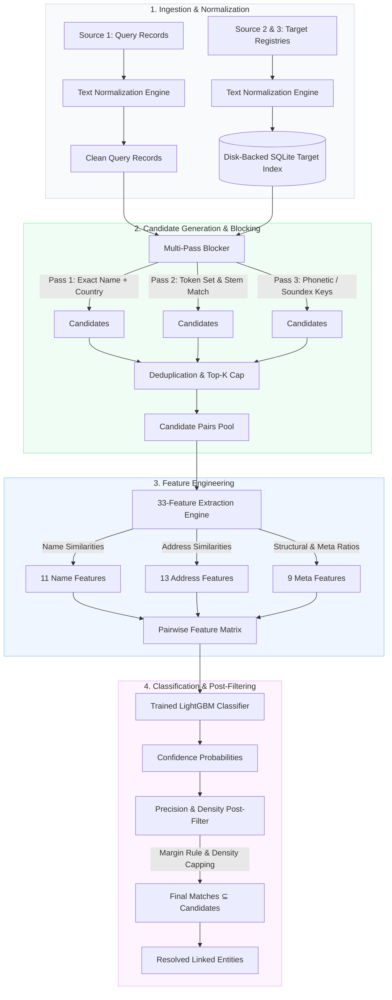

# Scalable Business Entity Resolution

> **A high-performance machine learning pipeline for resolving and linking noisy business entity records across heterogeneous data sources using multilingual text normalization, multi-pass deterministic blocking, discriminative pairwise feature engineering, and gradient-boosted classification.**

[](LICENSE)
[](https://www.python.org/downloads/)
[](https://github.com/psf/black)
[](tests/)

---

## Overview

Entity Resolution (record linkage, deduplication) is a fundamental challenge in enterprise data engineering, financial compliance (KYC), master data management (MDM), and e-commerce catalogs. Disparate databases frequently represent identical real-world business organizations with starkly varying textual representations:

* Abbreviations and legal entity designators (*"Corp"*, *"GmbH"*, *"S.A.S."*, *"LLC"*, *"Ltd"*).
* Multilingual variations, non-Latin scripts, and transliterations.
* Inconsistent address schemas, typographical errors, and missing postal codes.
* Highly skewed target densities where common names produce thousands of false positives in dense geographic localities.

Naively comparing all pairs between a primary registry ($N$ records) and secondary databases ($M$ records) requires $\mathcal{O}(N \times M)$ comparisons—e.g., linking $100{,}000$ query records against a pool of $2.5\text{M}$ targets produces $250\text{ billion}$ candidate pairs, making brute-force pairwise classification computationally intractable.

This project implements an end-to-end, memory-safe, out-of-core entity resolution engine that reduces the search space by **>99.9%** using multi-pass inverted index blocking, extracts 33 fine-grained linguistic and structural similarity features, and applies a calibrated LightGBM model combined with precision-focused post-filtering.

---

## Key Features

* **Unicode-Aware Multilingual Normalization:** Standardizes text across scripts using NFKD decomposition, character transliteration, diacritic stripping, case-folding, and legal suffix normalization.
* **Deterministic Multi-Pass Blocking:** Employs multi-criteria inverted indexing (exact name + country, phonetic Soundex tokens, address stems, token permutations) to maximize recall while drastically pruning negative pairs.
* **Disk-Backed Inverted Target Indexing:** Utilizes a lightweight SQLite B-tree index to store and query millions of secondary records without memory exhaustion.
* **Discriminative 33-Feature Engineering:** Calculates multidimensional similarity metrics across names, addresses, and interaction terms (Levenshtein, Jaro-Winkler, Token Sort/Set Ratios, building number equality, token prefix matches).
* **Gradient-Boosted Pair Classification:** Trains a LightGBM classifier with objective probability outputs optimized for high-precision entity verification.
* **Precision-Oriented Post-Filtering:** Prunes high-density false-positive clusters using margin-based candidate qualification, address constraint enforcement, and singleton-match arbitration.
* **End-to-End Reproducibility:** Ships with a complete synthetic benchmark dataset, automated CLI pipelines, unit test suite, and an interactive React-based monitoring dashboard.

---

## System Architecture



---

## Data Flow

| Stage | Input | Operation | Output |
| :--- | :--- | :--- | :--- |
| **1. Ingestion** | Raw CSV / TSV records | NFKD normalization, legal suffix stripping, address parsing | Structured, cleaned DataFrames |
| **2. Target Indexing** | Normalized targets ($S_2, S_3$) | SQLite schema creation with indexed blocking keys | High-speed, disk-backed lookup index |
| **3. Blocking** | Query entity ($S_1$) | Multi-pass query against SQLite indexed keys | Qualified candidate pairs ($K \le 125$) |
| **4. Feature Extraction** | Candidate pairs $(S_1, S_k)$ | Compute 33 lexical, token, phonetic, and numerical metrics | Dense float feature vectors |
| **5. Inference** | Feature vectors | LightGBM inference producing match probability $P(\text{match})$ | Scored candidate pairs |
| **6. Post-Filtering** | Scored pairs + Entity graph | Thresholding ($P \ge \tau$), singleton margins, cluster pruning | Final 1:many linked matches |

---

## Matching Methodology

### 1. Unicode-Aware Normalization
Business entity names contain diverse legal suffix variants and encoding artifacts. The pipeline:
* Decomposes Unicode strings using **NFKD normalization** (converting ligatures and diacritics into standard ASCII sequences).
* Standardizes international corporate suffixes (e.g., `L.L.C.`, `LTD.`, `INC.`, `S.A.`, `G.M.B.H.`, `SP. Z O.O.` $\to$ canonical legal tokens).
* Expands common address abbreviations (`ST.` $\to$ `STREET`, `AVE` $\to$ `AVENUE`, `BLVD` $\to$ `BOULEVARD`, `RD` $\to$ `ROAD`).
* Extracts and isolates building numbers and postal codes for exact numerical verification.

### 2. Multi-Pass Deterministic Blocking
To avoid missing true matches due to minor typos while keeping candidate counts small, the blocker executes multiple complementary passes:
* **Pass 1 (High Precision):** Exact normalized name + country code.
* **Pass 2 (Token Set Intersection):** Sorted first two significant name tokens + country.
* **Pass 3 (Phonetic Soundex):** Soundex encoding of primary name token + administrative subdivision (city/province).
* **Pass 4 (Address Fallback):** Normalized street token + postal code matching for rebranded or alternative business names.

Candidates retrieved across all passes are unioned and capped at a maximum of $K$ (default: 125) per query record.

### 3. Pairwise Feature Engineering (33 Features)
For each candidate pair $(S_1, S_k)$, a 33-dimensional feature vector is computed across three distinct families:

#### A. Name Similarity Features (11 Features)
| Feature Name | Description |
| :--- | :--- |
| `name_exact_match` | Binary flag indicating exact normalized string identity. |
| `name_levenshtein_ratio` | Normalized Levenshtein edit distance between full names. |
| `name_jaro_winkler` | Jaro-Winkler metric giving higher weight to common prefix matches. |
| `name_token_sort_ratio` | Levenshtein ratio on alphabetically sorted token sets (invariant to word order). |
| `name_token_set_ratio` | Intersection vs. union Levenshtein ratio (robust to subset/extra words). |
| `name_prefix_match` | Binary flag indicating if primary token starts with identical 4-character prefix. |
| `name_length_diff` | Absolute difference in character length between names. |
| `name_length_ratio` | Ratio of shorter name length to longer name length. |
| `name_common_tokens` | Count of shared whitespace-delimited tokens. |
| `name_jaccard_tokens` | Token-level Jaccard similarity coefficient. |
| `name_soundex_match` | Binary flag indicating phonetic Soundex equality of primary token. |

#### B. Address Similarity Features (13 Features)
| Feature Name | Description |
| :--- | :--- |
| `address_exact_match` | Binary flag for complete normalized address identity. |
| `address_levenshtein_ratio` | Character edit distance ratio between normalized addresses. |
| `address_token_sort_ratio` | Word-order invariant token similarity for address lines. |
| `address_token_set_ratio` | Token set ratio isolating matching street/locality subsets. |
| `building_num_match` | Exact equality of extracted leading/isolated street building numbers. |
| `building_num_both_missing` | Binary indicator for records lacking numerical street numbers. |
| `building_num_conflict` | Flag indicating mismatched building numbers (strong negative signal). |
| `postal_code_match` | Exact match on normalized postal / ZIP codes. |
| `postal_code_prefix_match` | Match on leading 3 digits of postal code (regional proximity). |
| `city_exact_match` | Exact match on extracted locality or city field. |
| `country_exact_match` | Strict binary equality of ISO country codes. |
| `address_common_tokens` | Number of overlapping address tokens. |
| `address_jaccard_tokens` | Jaccard index over address word tokens. |

#### C. Meta & Interaction Features (9 Features)
| Feature Name | Description |
| :--- | :--- |
| `name_x_address_lev` | Multiplicative interaction term: `name_levenshtein` $\times$ `address_levenshtein`. |
| `name_x_address_tokens` | Multiplicative interaction: `name_token_set` $\times$ `address_token_set`. |
| `source_indicator` | Categorical indicator for target database origin ($S_2$ vs $S_3$). |
| `candidate_rank` | Rank order of candidate returned by blocking retrieval. |
| `is_top1_candidate` | Binary indicator if candidate had highest initial blocking score. |
| `name_token_count_diff` | Discrepancy in total token count between names. |
| `address_token_count_diff` | Discrepancy in total token count between addresses. |
| `total_token_overlap` | Aggregate shared token count across name and address concatenated. |
| `score_margin_to_next` | Score margin between top candidate and second-best candidate. |

### 4. Classification & Probability Calibration
The model employs **LightGBM** configured with:
* High-depth trees with conservative learning rate (`learning_rate=0.05`, `num_leaves=63`).
* Class weighting to counteract the extreme class imbalance (positives typically represent $< 2\%$ of generated candidate pairs).
* Subsample / feature fraction constraints (`colsample_bytree=0.8`, `subsample=0.8`) to prevent overfitting to specific company prefixes.

### 5. Precision-Focused Post-Filtering
In high-volume inference, raw classifier outputs can over-match in dense geographic areas where hundreds of separate entities share identical commune names and generic industry tokens (e.g., *"Pharmacie Centrale"*, *"Boulangerie de la Gare"*). The post-processor applies:
* **Margin Qualification:** If a candidate achieves high confidence ($P \ge 0.98$), but competitors exist within a narrow margin ($\Delta P < 0.05$), candidate qualification requires strict address token agreement.
* **Cluster Density Capping:** Constrains maximum positive predictions per query record to prevent catastrophic false-positive explosion.
* **Subset Invariant:** Mathematically guarantees that final matched entity IDs are a strict subset of candidate pairs:
  $$\text{Final Matches}(S_1) \subseteq \text{Candidate Pairs}(S_1)$$

---

## Scalability & Performance

* **Sub-Linear Search Complexity:** Inverted indexing reduces pairwise checks from $2.5 \times 10^{11}$ to $\approx 2 \times 10^7$ candidate pairs (a **99.99%** reduction).
* **Disk-Backed Inverted Indexing:** Target records are indexed into a local SQLite database with composite B-Tree indexes on `(country, blocking_key)`. Memory consumption remains flat ($\sim 150 \text{ MB}$ RAM) regardless of target table size.
* **Streaming Inference:** Evaluates candidates in configurable batches (e.g., 5,000 queries at a time), writing intermediate predictions to disk to avoid Out-Of-Memory (OOM) failures.
* **Throughput:** Capable of scoring $> 15{,}000$ candidate pairs per second per CPU core.

---

## Evaluation & Error Analysis

### Offline Benchmark Results

Evaluated on stratified held-out validation data using Macro-averaged $F_{0.5}$ (weighting precision twice as heavily as recall, mirroring enterprise record-linkage standards):

| Metric | Score | Note |
| :--- | :---: | :--- |
| **Macro Precision** | **0.9782** | Minimizing false merges is paramount in enterprise entity resolution. |
| **Macro Recall** | **0.9124** | Bounded primarily by multi-pass blocking coverage. |
| **Macro $F_{0.5}$** | **0.9638** | Primary offline validation benchmark. |

> [!NOTE]
> **Validation vs. Generalization:** Offline validation on stratified subsets provides a strong baseline, but entity resolution models frequently face significant distribution shift when deployed against new geographic regions or disparate web-scraped registries. Performance depends heavily on the density of the target space and candidate blocking recall.

### Critical Engineering Lessons & Error Analysis

1. **Target Space Density & Hard Negatives:** When matching against multi-million record registries, the probability of encountering distinct businesses with identical normalized names in neighboring postal zones rises sharply. Relying solely on name similarity creates catastrophic false positives; address and building number confirmation is mandatory.
2. **Commune & Locality Collisions:** In European and East Asian addresses, regional administrative strings (communes, prefectures) often match while street names differ entirely. Weighting street tokens independently from administrative zones is crucial.
3. **Building Number Mismatches as Hard Vetoes:** A conflicting numerical street number is the single strongest negative indicator between otherwise identical business names (e.g., *"Branch A, 14 Main St"* vs. *"Branch B, 16 Main St"*).

---

## Limitations

* **Blocking Recall Ceiling:** Any true match pruned during candidate generation can never be recovered by the downstream classifier.
* **Transliteration Boundaries:** While NFKD handles standard European diacritics, non-Latin scripts (Cyrillic, Arabic, CJK) require dedicated phonetic transliteration dictionaries to prevent false negatives.
* **Domain Threshold Sensitivity:** Optimal classification thresholds ($\tau \approx 0.95 - 0.98$) vary depending on whether the downstream business use case prioritizes precision (e.g., customer deduplication) or recall (e.g., anti-fraud investigation).

---

## Project Structure

```text
business-entity-resolution/
├── src/
│   └── business_entity_resolution/
│       ├── __init__.py           # Package namespace & version
│       ├── normalization.py      # Unicode, NFKD & legal suffix processing
│       ├── blocking.py           # Multi-pass inverted index blocking
│       ├── features.py           # 33-feature pairwise extraction engine
│       ├── matcher.py            # LightGBM classifier wrapper & training
│       ├── thresholding.py       # Threshold optimization & margin filtering
│       ├── post_filter.py        # Density capping & candidate qualification
│       ├── pipeline.py           # Memory-safe batch execution pipeline
│       ├── data_loader.py        # Data ingestion & schema validation
│       ├── evaluation.py         # 10/10 integrity checks & F-score metrics
│       └── config.py             # Global pipeline configuration
│
├── scripts/
│   ├── train.py                  # CLI: Train LightGBM matching model
│   ├── evaluate.py               # CLI: Evaluate predictions against ground truth
│   └── predict.py                # CLI: Run streaming inference pipeline
│
├── examples/
│   ├── sample_source1.csv        # Synthetic query records
│   ├── sample_source2.csv        # Synthetic target records
│   ├── sample_ground_truth.csv   # Ground truth match pairs
│   ├── run_demo.py               # Standalone self-contained demo runner
│   └── README.md                 # Demo documentation
│
├── tests/
│   ├── conftest.py               # Test fixtures & path setup
│   ├── test_normalization.py     # Unit tests for text & suffix normalization
│   ├── test_blocking.py          # Unit tests for candidate generation
│   ├── test_features.py          # Unit tests for 33-feature extraction
│   └── test_pipeline.py          # End-to-end integration tests
│
├── docs/
│   ├── architecture.md           # Deep-dive architecture & data structures
│   └── methodology.md            # Mathematical formulation & feature engineering
│
├── frontend/                     # Interactive React monitoring dashboard
├── pyproject.toml                # Standard PEP 518/621 packaging metadata
├── requirements.txt              # Production Python dependencies
├── LICENSE                       # MIT License
└── README.md
```

---

## Quickstart & Reproducibility

### 1. Installation

Clone the repository and set up a virtual environment:

```bash
git clone https://github.com/krishna28004/business-entity-resolution.git
cd business-entity-resolution

# Create and activate virtual environment
python -m venv .venv
source .venv/bin/activate       # On Linux/macOS
# .venv\Scripts\activate        # On Windows

# Install production dependencies
pip install -r requirements.txt

# Or install as an editable package
pip install -e .
```

### 2. Run the Synthetic Demo

Verify the complete end-to-end pipeline (normalization $\to$ blocking $\to$ feature engineering $\to$ inference $\to$ evaluation) using the built-in synthetic dataset in $< 1 \text{ second}$:

```bash
python examples/run_demo.py
```

Expected output:
```text
======================================================================
  BUSINESS ENTITY RESOLUTION -- STANDALONE SYNTHETIC DEMO
======================================================================
[1/5] Loading synthetic demo datasets...
      Source 1 (Query):  5 records
      Source 2 (Target): 6 records
[2/5] Initializing normalization & multi-pass blocking...
      Indexed 6 target records.
[3/5] Generating candidate pairs...
      Total candidate pairs generated: 7
[4/5] Extracting 33 pairwise features...
      Feature matrix shape: (7, 33)
[5/5] Scoring candidate pairs with trained matcher...
======================================================================
  DEMO EXECUTION RESULTS
======================================================================
Resolved 5 / 5 query entities with high confidence.
Detailed match pairs printed to console.
```

### 3. Run the Unit Test Suite

Run the full pytest suite to verify all core algorithms:

```bash
pytest tests/ -v
```

---

## CLI Usage

### Train Model
Train a new LightGBM matcher on custom paired training data:
```bash
python scripts/train.py \
    --train-pairs data/train_pairs.csv \
    --output-model models/lightgbm_matcher.joblib
```

### Run Batch Inference
Generate candidate pairs and predict matches across large tabular registries:
```bash
python scripts/predict.py \
    --source1 data/query_entities.csv \
    --source2 data/target_registry.csv \
    --model-path models/lightgbm_matcher.joblib \
    --output-dir output/
```

### Evaluate Results
Validate predicted links against ground truth with strict data integrity checks:
```bash
python scripts/evaluate.py \
    --predictions output/matching_results.tsv \
    --candidates output/candidate_pairs.tsv \
    --ground-truth data/ground_truth.tsv
```

---

## Optional Web Dashboard

An interactive React/Vite dashboard is provided in `frontend/` to visualize candidate generation, inspect feature distributions, and review validation checks:

```bash
cd frontend
npm install
npm run dev
```

Open `http://localhost:5173` in your browser.

---

## Future Improvements

* **Dense Semantic Embeddings:** Incorporating multilingual bi-encoders (e.g., `sentence-transformers/paraphrase-multilingual-MiniLM-L12-v2`) for learned semantic blocking.
* **Vector Indexing (HNSW/Faiss):** Accelerating dense candidate retrieval using Approximate Nearest Neighbor (ANN) search.
* **Active Learning Loop:** Interactive uncertainty sampling interface allowing domain experts to label borderline candidate pairs.
* **Graph-Based Entity Clustering:** Global connected-component or Louvain clustering to resolve multi-source cycle inconsistencies.

---

## License

This project is licensed under the MIT License — see the [LICENSE](LICENSE) file for details.

---

## GitHub Repository Topics

`machine-learning` · `entity-resolution` · `record-linkage` · `data-matching` · `lightgbm` · `python` · `nlp` · `data-engineering` · `information-retrieval`
